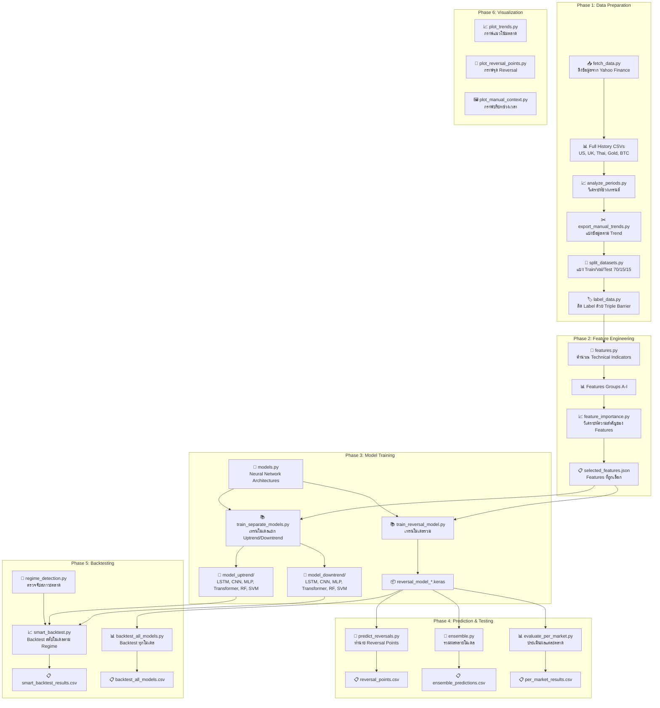

# 🔄 Market Reversal Prediction Model - Complete Workflow

โปรเจกต์นี้เป็นระบบ **Machine Learning สำหรับทำนายจุดกลับตัวของตลาด (Market Reversal Prediction)** ใช้ Deep Learning และ Machine Learning หลายโมเดลในการวิเคราะห์และซื้อขายในตลาดหุ้นและสินทรัพย์ต่างๆ

---

## 📊 ภาพรวมระบบ (System Overview)



---

## 📁 โครงสร้างโปรเจกต์ (Project Structure)

```
p-e/
├── 📂 Root Directory (Data Preparation & Visualization)
│   ├── fetch_data.py              # ดึงข้อมูลจาก Yahoo Finance
│   ├── analyze_periods.py         # วิเคราะห์ช่วงเทรนด์
│   ├── export_trends.py           # ส่งออกข้อมูลตาม SMA200
│   ├── export_manual_trends.py    # ส่งออกข้อมูลตามช่วงเวลาที่กำหนด
│   ├── split_datasets.py          # แบ่ง Train/Val/Test
│   ├── label_data.py              # ติด Label ด้วย Triple Barrier
│   ├── plot_trends.py             # พล็อตกราฟแนวโน้ม
│   ├── plot_reversal_points.py    # พล็อตจุด Reversal
│   ├── plot_manual_context.py     # พล็อตบริบทข้อมูล
│   ├── check_dates.py             # ตรวจสอบวันที่ในข้อมูล
│   └── debug_tickers.py           # ทดสอบ Tickers
│
├── 📂 full_data/                  # ข้อมูลราคาทั้งหมด
│   ├── US_full_history.csv
│   ├── UK_full_history.csv
│   ├── Thai_full_history.csv
│   ├── Gold_full_history.csv
│   └── BTC_full_history.csv
│
├── 📂 trend_data_manual/          # ข้อมูลแยกตาม Trend
│   ├── {Market}_uptrend.csv
│   ├── {Market}_downtrend.csv
│   └── split/
│       ├── train/*.csv            # 70% ข้อมูลเทรน
│       ├── val/*.csv              # 15% ข้อมูล Validation
│       └── test/*.csv             # 15% ข้อมูลทดสอบ
│
├── 📂 model/                      # Core ML System
│   ├── features.py                # Feature Engineering
│   ├── models.py                  # Neural Network Architectures
│   ├── regime_detection.py        # Market Regime Detection
│   ├── train_separate_models.py   # เทรนโมเดลแยก Trend
│   ├── train_reversal_model.py    # เทรนโมเดลรวม
│   ├── feature_importance.py      # วิเคราะห์ Feature Importance
│   ├── predict_reversals.py       # ทำนาย Reversal Points
│   ├── ensemble.py                # รวมผลหลายโมเดล
│   ├── evaluate_per_market.py     # ประเมินผลแต่ละตลาด
│   ├── smart_backtest.py          # Smart Backtesting
│   ├── backtest_all_models.py     # Backtest ทุกโมเดล
│   ├── selected_features.json     # Features ที่เลือก
│   └── model_uptrend/             # โมเดลสำหรับ Uptrend
│       └── model_downtrend/       # โมเดลสำหรับ Downtrend
│
└── 📂 result/                     # ผลลัพธ์
```

---

## 🛠️ รายละเอียดไฟล์ทั้งหมด (Complete File Documentation)

---

### 📥 Phase 1: Data Preparation

#### 1.1 `fetch_data.py` - ดึงข้อมูลจาก Yahoo Finance

**หน้าที่:** ดาวน์โหลดข้อมูลราคา OHLCV จาก Yahoo Finance สำหรับ 5 ตลาด

**Markets:**
| Market | Ticker | Description |
|--------|--------|-------------|
| US | ^GSPC | S&P 500 Index |
| UK | ^FTSE | FTSE 100 Index |
| Thai | ^SET.BK | SET Index (Thailand) |
| Gold | GC=F | Gold Futures |
| BTC | BTC-USD | Bitcoin |

**Output:**
- `{Market}_full_history.csv` - ข้อมูลประวัติทั้งหมด (OHLCV)
- `combined_market_data.csv` - ข้อมูลรวมทุกตลาด (Close only)

**วิธีรัน:**
```bash
python fetch_data.py
```

---

#### 1.2 `analyze_periods.py` - วิเคราะห์ช่วง Trend

**หน้าที่:** วิเคราะห์และหา Uptrend/Downtrend periods ที่ยาวที่สุดในแต่ละตลาดโดยใช้ SMA200

**Logic:**
- ถ้า Close > SMA200 → Uptrend
- ถ้า Close ≤ SMA200 → Downtrend

**Output:** แสดงช่วงเวลา Uptrend/Downtrend ที่ยาวที่สุด 3 อันดับแรกของแต่ละตลาด

---

#### 1.3 `export_manual_trends.py` - ส่งออกข้อมูลตามช่วงเวลาที่กำหนด

**หน้าที่:** ตัดข้อมูลตามช่วงเวลาที่กำหนดด้วยมือ (Manual) สำหรับแต่ละตลาด

**ช่วงเวลาที่กำหนด:**
| Market | Uptrend Period | Downtrend Period |
|--------|----------------|------------------|
| US | 2010-01-01 → 2017-12-31 | 2000-01-01 → 2009-03-09 |
| UK | 2009-03-01 → 2015-05-01 | 2000-01-01 → 2009-02-28 |
| Thai | 2009-01-01 → 2015-01-01 | 1994-01-01 → 2001-01-01 |
| Gold | 2005-01-01 → 2011-08-31 | 2011-09-01 → 2018-08-01 |
| BTC | 2013-01-01 → 2017-12-15 | 2018-01-01 → 2019-12-31 |

**Output:** `trend_data_manual/{Market}_{uptrend/downtrend}.csv`

---

#### 1.4 `split_datasets.py` - แบ่ง Train/Val/Test

**หน้าที่:** แบ่งข้อมูลเป็น Training, Validation, และ Test sets

**สัดส่วน:**
- **Train:** 70%
- **Validation:** 15%
- **Test:** 15%

**Output:** `trend_data_manual/split/{train/val/test}/*.csv`

---

#### 1.5 `label_data.py` - ติด Label ด้วย Triple Barrier

**หน้าที่:** ติด Label ให้ข้อมูลโดยใช้ Triple Barrier Method

**ฟังก์ชันหลัก:**
| Function | Description |
|----------|-------------|
| `apply_triple_barrier(df, t=20, h=0.02)` | ติด Label (-1, 0, 1) |
| `add_swing_features(df, lookback=5)` | เพิ่ม Swing High/Low features |

**Parameters:**
- `t = 20` - Time horizon (bars)
- `h = 0.02` - Barrier threshold (2%)

**Labels:**
- `1` = Bullish (ราคาขึ้น h% ก่อน)
- `-1` = Bearish (ราคาลง h% ก่อน)
- `0` = Neutral (ไม่ถึง barrier ภายใน t bars)

---

### 📊 Phase 2: Feature Engineering

#### 2.1 `features.py` - Feature Engineering

**หน้าที่:** คำนวณ Technical Indicators และ Features สำหรับโมเดล

**ฟังก์ชันหลัก:**
| Function | Description |
|----------|-------------|
| `calculate_features(df)` | คำนวณ Features ทั้งหมด (Groups A-I) |
| `get_feature_columns(df)` | ดึงรายชื่อ Features ที่จะใช้ |
| `get_selected_features(df)` | ดึง Features จาก selected_features.json |

**Features Groups:**

| Group | Name | Features |
|-------|------|----------|
| **A** | Price-based | SMA_10, SMA_20, SMA_50, EMA_10, EMA_20, Price_Change_% |
| **B** | Momentum | RSI, MACD, MACD_Signal, MACD_Histogram, Stochastic_K, Stochastic_D |
| **C** | Volatility | Bollinger_Upper, Bollinger_Lower, Bollinger_Mid, ATR |
| **D** | Volume | OBV, Volume_MA_Ratio |
| **E** | Trend Strength | ADX, Plus_DI, Minus_DI |
| **F** | Advanced Oscillators | Williams_%R, CCI, MFI |
| **G** | Pattern Recognition | Candlestick Patterns (Doji, Hammer, Engulfing, etc.) |
| **H** | Market Structure | Support, Resistance, Distance_To_Support, Distance_To_Resistance |
| **I** | Chart Patterns | Double_Bottom, Triple_Bottom, Inv_Head_Shoulders, Rounded_Bottom, V_Bottom |

---

#### 2.2 `feature_importance.py` - วิเคราะห์ Feature Importance

**หน้าที่:** วิเคราะห์ความสำคัญของแต่ละ Feature โดยใช้ Random Forest

**Method:**
1. เทรน RandomForest บน Training Data (Flattened Windows)
2. คำนวณ Feature Importance
3. Aggregate Importance ข้าม Time Steps
4. เลือก Features ที่ Importance > 0.5%

**Parameters:**
- `LOOKBACK = 60`
- `SELECTED_THRESHOLD = 0.005` (0.5%)
- `MIN_FEATURES = 10` (Fallback)

**Output:**
- `feature_importance.csv` - Ranking ทุก Features
- `selected_features.json` - Features ที่ถูกเลือก

---

### 🧠 Phase 3: Model Training

#### 3.1 `models.py` - Neural Network Architectures

**หน้าที่:** กำหนดโครงสร้าง Deep Learning Models

**โมเดลที่มี:**

| Model | Function | Description |
|-------|----------|-------------|
| **LSTM** | `build_lstm()` | Enhanced Bidirectional LSTM with Self-Attention |
| **CNN** | `build_cnn()` | 1D CNN with Residual Connections |
| **MLP** | `build_mlp()` | Multi-Layer Perceptron |
| **Transformer** | `build_transformer()` | Transformer with Multiple Encoder Blocks |

**Architecture Details:**

```
LSTM:
├── Bidirectional LSTM (128) + BatchNorm + Dropout(0.3)
├── Bidirectional LSTM (64) + BatchNorm + Dropout(0.3)
├── MultiHeadAttention (4 heads) + LayerNorm
├── Bidirectional LSTM (32) + BatchNorm + Dropout(0.3)
├── Dense (64 → 32) + Dropout
└── Output (Softmax)

CNN:
├── Conv1D Block 1 (64 filters)
├── Conv1D Block 2 (128 filters) + Residual
├── Conv1D Block 3 (64 filters)
├── GlobalAveragePooling1D
├── Dense (64 → 32) + Dropout
└── Output (Softmax)

Transformer:
├── Dense Projection (64)
├── Encoder Block 1 (4 heads, key_dim=64, ff_dim=128)
├── Encoder Block 2
├── Encoder Block 3
├── GlobalAveragePooling1D
├── Dense (64 → 32) + Dropout
└── Output (Softmax)
```

---

#### 3.2 `train_separate_models.py` - เทรนโมเดลแยก Trend

**หน้าที่:** เทรนโมเดลแยกตาม Uptrend และ Downtrend

**Parameters:**
```python
LOOKBACK = 30           # Time steps ย้อนหลัง
BATCH_SIZE = 32
EPOCHS = 100
LABEL_SMOOTHING = 0.1
BINARY_MODE = True      # ใช้ 2 classes (Bullish/Bearish)
```

**Models ที่เทรน:**
- LSTM
- CNN
- MLP
- Transformer
- RandomForest
- SVM

**Workflow:**
1. โหลดข้อมูลแยก Uptrend/Downtrend
2. คำนวณ Features + สร้าง Sliding Windows
3. เทรน 6 โมเดล
4. บันทึกโมเดลและผลลัพธ์

**Output:**
- `model_uptrend/model_{ModelName}.keras` หรือ `.pkl`
- `model_downtrend/model_{ModelName}.keras` หรือ `.pkl`
- `separate_models_comparison.csv`

---

#### 3.3 `train_reversal_model.py` - เทรนโมเดลรวม

**หน้าที่:** เทรนโมเดลรวม (ไม่แยก Trend) สำหรับทุก Markets

**Parameters:**
```python
LOOKBACK = 60
BATCH_SIZE = 32
EPOCHS = 50
```

**Output:** `reversal_model_{ModelName}.keras`

---

### 🎯 Phase 4: Regime Detection & Prediction

#### 4.1 `regime_detection.py` - ตรวจจับสภาวะตลาด

**หน้าที่:** ตรวจจับสภาวะตลาด (Uptrend/Downtrend) ด้วย 3 Methods

**Class: `RegimeDetector`**

| Method | Algorithm | Description |
|--------|-----------|-------------|
| `detect_gmm(df)` | Gaussian Mixture Model | จัดกลุ่มตลาดตาม Log Returns และ Volatility |
| `detect_adx_supertrend(df)` | ADX + Supertrend | วัด Trend Strength ผ่าน ADX (>25 = Strong Trend) |
| `detect_hmm(df)` | Hidden Markov Model | Unsupervised Learning หา Hidden States |

**GMM Logic:**
- ใช้ 2 Components (Bull/Bear)
- Uptrend = State ที่มี Mean Return สูงกว่า

**ADX+Supertrend Logic:**
- Uptrend = ADX > 25 AND Supertrend == Green
- Downtrend = Everything else

**HMM Logic:**
- ใช้ GaussianHMM (2 components)
- Bull State = State ที่มี Mean Return สูงกว่า

**Fallback:** SMA200 (Close > SMA200 = Uptrend)

---

#### 4.2 `predict_reversals.py` - ทำนาย Reversal Points

**หน้าที่:** ทำนายจุด Reversal จาก Test Data

**Logic:**
1. โหลดโมเดลและ Scaler
2. ประมวลผล Test Files
3. หาจุดที่ Prediction เปลี่ยน:
   - **URP:** เปลี่ยนเป็น Bullish (2)
   - **DRP:** เปลี่ยนเป็น Bearish (0)

**Output:** `reversal_points.csv` (Market, Date, Price, Type, Confidence)

---

#### 4.3 `ensemble.py` - รวมผลหลายโมเดล

**หน้าที่:** รวมผลทำนายจากหลายโมเดลด้วย Soft Voting

**Models ที่ใช้:** LSTM, CNN, MLP, Transformer

**Method:**
1. ทำนายด้วยแต่ละโมเดล
2. หาค่าเฉลี่ย Probabilities
3. เลือก Class ที่มี Probability สูงสุด

**Output:** `ensemble_predictions.csv`

---

#### 4.4 `evaluate_per_market.py` - ประเมินผลแต่ละตลาด

**หน้าที่:** ประเมินประสิทธิภาพของโมเดลในแต่ละตลาดแยกกัน

**Metrics:**
- Accuracy
- F1-Score (Macro, Bearish, Bullish)

**Output:** `per_market_results.csv`

---

### 📈 Phase 5: Backtesting

#### 5.1 `smart_backtest.py` - Smart Backtesting

**หน้าที่:** Backtest โดยสลับโมเดลตามสภาวะตลาด

**Logic:**
```python
if is_uptrend:
    use model_uptrend_{ModelName}
else:
    use model_downtrend_{ModelName}
```

**Parameters:**
```python
LOOKBACK = 30
SMA_PERIOD = 200
INITIAL_CAPITAL = 10000.0
TRANSACTION_COST = 0.001   # 0.1%
THRESHOLD_LONG = 0.54      # Prob > 0.54 → Long
THRESHOLD_SHORT = 0.46     # Prob < 0.46 → Short
```

**Regime Methods ที่ทดสอบ:**
- `SMA200` (Classic)
- `GMM` (Gaussian Mixture)
- `ADX_ST` (ADX + Supertrend)
- `HMM` (Hidden Markov Model)

**Trading Strategy:**
- ถ้า Prob(Bullish) > 0.54 → **Long**
- ถ้า Prob(Bullish) < 0.46 → **Short**
- อื่นๆ → **Cash/Hold**

**Metrics:**
- Total Return (%)
- Max Drawdown (%)
- Sharpe Ratio
- Trend-specific Performance (Uptrend/Downtrend)

**Output:**
- `smart_backtest_results.csv` - ผลลัพธ์ทุก Market/Model/Regime
- `backtest_plots/*.png` - กราฟ Equity Curve

---

#### 5.2 `backtest_all_models.py` - Backtest ทุกโมเดล

**หน้าที่:** Backtest ทุกโมเดลบนทุกตลาดและ Trend แยกกัน

**Models:** LSTM, CNN, MLP, Transformer, RandomForest, SVM

**Output:** `backtest_all_models.csv`

---

### 📊 Phase 6: Visualization

#### 6.1 `plot_trends.py` - พล็อตกราฟแนวโน้ม

**หน้าที่:** สร้างกราฟราคาพร้อม SMA200 และ Shading Uptrend/Downtrend

**Output:** `market_trend_{Market}.png`

---

#### 6.2 `plot_reversal_points.py` - พล็อตจุด Reversal

**หน้าที่:** สร้างกราฟแสดงจุด URP/DRP ที่ทำนายได้

**Markers:**
- 🔺 **Green Triangle** = URP (Upward Reversal)
- 🔻 **Red Triangle** = DRP (Downward Reversal)

**Output:** `prediction_{Market}_{trend}.png`

---

#### 6.3 `plot_manual_context.py` - พล็อตบริบทข้อมูล

**หน้าที่:** สร้างกราฟแสดง Full History พร้อม Highlight ช่วงที่เลือกใช้

**Output:** `context_{Market}.png`

---

### 🔧 Utility Scripts

#### `check_dates.py`
ตรวจสอบ Date Range ของ Test Set แต่ละตลาด

#### `debug_tickers.py`
ทดสอบ Tickers ว่าสามารถดึงข้อมูลจาก Yahoo Finance ได้หรือไม่

---

## 🚀 วิธีใช้งาน (How to Run)

### Quick Start - Full Pipeline

```bash
# 1. ดึงข้อมูล
python fetch_data.py

# 2. วิเคราะห์และเตรียมข้อมูล
python analyze_periods.py
python export_manual_trends.py
python split_datasets.py
python label_data.py

# 3. คำนวณ Feature Importance (Optional)
cd model
python feature_importance.py

# 4. เทรนโมเดลแยก Trend
python train_separate_models.py

# 5. Smart Backtest
python smart_backtest.py
```

---

### Step-by-Step Guide

#### Step 1: เตรียมข้อมูล
```bash
python fetch_data.py              # ดึงข้อมูลดิบ
python export_manual_trends.py    # แบ่งตาม Trend
python split_datasets.py          # แบ่ง Train/Val/Test
python label_data.py              # ติด Label
```

#### Step 2: Feature Engineering
```bash
cd model
python feature_importance.py      # สร้าง selected_features.json
```

#### Step 3: เทรนโมเดล
```bash
# วิธีที่ 1: แยก Trend (Recommended)
python train_separate_models.py

# วิธีที่ 2: รวม Trend
python train_reversal_model.py
```

#### Step 4: Backtest
```bash
python smart_backtest.py          # Smart Backtest ด้วย Regime Switching
```

#### Step 5: วิเคราะห์ผล
```bash
python evaluate_per_market.py     # ประเมินแต่ละตลาด
python ensemble.py                # ทดสอบ Ensemble
```

---

## 📈 Markets & Data

**ตลาดที่รองรับ:**
| Market | Label | Asset Type |
|--------|-------|------------|
| 🇺🇸 US | S&P 500 | Stock Index |
| 🇬🇧 UK | FTSE 100 | Stock Index |
| 🇹🇭 Thai | SET Index | Stock Index |
| 🪙 Gold | GC=F | Commodity Futures |
| ₿ BTC | BTC-USD | Cryptocurrency |

---

## 📊 Output Files Summary

| File | Location | Description |
|------|----------|-------------|
| `{Market}_full_history.csv` | Root | ข้อมูลราคาทั้งหมด |
| `{Market}_{trend}.csv` | trend_data_manual/ | ข้อมูลแยกตาม Trend |
| `*_labeled.csv` | trend_data_manual/split/ | ข้อมูลที่ติด Label แล้ว |
| `selected_features.json` | model/ | Features ที่ถูกเลือก |
| `feature_importance.csv` | model/ | Ranking Feature Importance |
| `model_{ModelName}.keras/.pkl` | model_uptrend/ | โมเดล Uptrend |
| `model_{ModelName}.keras/.pkl` | model_downtrend/ | โมเดล Downtrend |
| `separate_models_comparison.csv` | model/ | เปรียบเทียบโมเดลแยก Trend |
| `smart_backtest_results.csv` | model/ | ผลลัพธ์ Smart Backtest |
| `per_market_results.csv` | model/ | ผลประเมินแยกตลาด |
| `backtest_plots/*.png` | model/ | กราฟ Equity Curve |

---

## 🔑 Key Parameters

```python
# Feature Engineering
LOOKBACK = 30              # Time window for model input

# Training
BATCH_SIZE = 32
EPOCHS = 100
LABEL_SMOOTHING = 0.1
BINARY_MODE = True         # 2 classes (Bullish/Bearish)

# Backtesting
INITIAL_CAPITAL = 10000.0
TRANSACTION_COST = 0.001   # 0.1%
THRESHOLD_LONG = 0.54      # Go Long threshold
THRESHOLD_SHORT = 0.46     # Go Short threshold
SMA_PERIOD = 200           # For Regime Detection

# Feature Selection
SELECTED_THRESHOLD = 0.005 # 0.5% importance threshold
MIN_FEATURES = 10          # Minimum features to select
```

---

## 📝 Notes

1. **BINARY_MODE = True** ใน `train_separate_models.py` จะลบ Class "Neutral" ออก เหลือแค่ Bullish/Bearish
2. **Smart Backtest** จะเลือกโมเดลที่เหมาะกับ Regime ปัจจุบันโดยอัตโนมัติ
3. **Regime Detection** มีหลายวิธี: SMA200, GMM, ADX+Supertrend, HMM
4. ถ้า hmmlearn ไม่ได้ติดตั้ง จะ Fallback ไปใช้ SMA200 อัตโนมัติ
