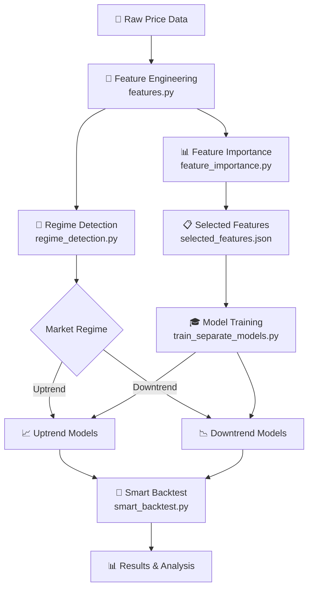

# 🔄 Market Reversal Prediction Model Workflow

โปรเจกต์นี้เป็นระบบ **Machine Learning สำหรับทำนายจุดกลับตัวของตลาด (Market Reversal Prediction)** ซึ่งใช้ในการซื้อขายในตลาดหุ้นและสินทรัพย์ต่างๆ

---

## 📊 ภาพรวมระบบ (System Overview)



---

## 🛠️ ไฟล์หลักและหน้าที่ (Core Files)

### 1. `features.py` - Feature Engineering
**หน้าที่:** คำนวณ Technical Indicators และ Features สำหรับโมเดล

**ฟังก์ชันหลัก:**
- `calculate_features(df)` - คำนวณ Features ทั้งหมด (Groups A-I)
- `get_feature_columns(df)` - ดึงรายชื่อ Features ที่จะใช้
- `get_selected_features(df)` - ดึง Features จาก `selected_features.json`

**Features ที่คำนวณ:**
- **Group A:** Price-based (SMA, EMA, Price Change %)
- **Group B:** Momentum (RSI, MACD, Stochastic)
- **Group C:** Volatility (Bollinger Bands, ATR)
- **Group D:** Volume (OBV, Volume MA Ratio)
- **Group E:** Trend Strength (ADX, +DI, -DI)
- **Group F:** Advanced Oscillators (Williams %R, CCI, MFI)
- **Group G:** Pattern Recognition (Candlestick Patterns)
- **Group H:** Market Structure (Support/Resistance)
- **Group I:** Chart Patterns (Double Bottom, Head & Shoulders, etc.)

---

### 2. `models.py` - Neural Network Architectures
**หน้าที่:** กำหนดโครงสร้าง Deep Learning Models

**โมเดลที่มี:**
| Model | Description |
|-------|-------------|
| `build_lstm()` | Enhanced Bidirectional LSTM with Self-Attention |
| `build_cnn()` | 1D CNN with Residual Connections |
| `build_mlp()` | Multi-Layer Perceptron |
| `build_transformer()` | Transformer with Multiple Encoder Blocks |

---

### 3. `regime_detection.py` - Market Regime Detection
**หน้าที่:** ตรวจจับสภาวะตลาด (Uptrend/Downtrend)

**Class: `RegimeDetector`**

| Method | Algorithm | Description |
|--------|-----------|-------------|
| `detect_gmm()` | Gaussian Mixture Model | จัดกลุ่มตลาดตาม Returns และ Volatility |
| `detect_adx_supertrend()` | ADX + Supertrend | วัด Trend Strength ผ่าน ADX (>25 = Strong Trend) |
| `detect_hmm()` | Hidden Markov Model | Unsupervised Learning หา Hidden States |

**Fallback:** SMA200 (Close > SMA200 = Uptrend)

---

### 4. `train_separate_models.py` - Model Training
**หน้าที่:** เทรนโมเดลแยกตาม Trend Type

**Workflow:**
1. โหลดข้อมูลแยก Uptrend/Downtrend
2. คำนวณ Features + สร้าง Sliding Windows (LOOKBACK=30)
3. เทรน 6 โมเดล: LSTM, CNN, MLP, Transformer, RandomForest, SVM
4. บันทึกโมเดลไปยัง `model_uptrend/` และ `model_downtrend/`

**Parameters:**
```python
LOOKBACK = 30           # Time steps ย้อนหลัง
BATCH_SIZE = 32
EPOCHS = 100
BINARY_MODE = True      # ใช้ 2 classes (Bullish/Bearish) แทน 3
```

**Output Models:**
- `model_uptrend/model_LSTM.keras`
- `model_downtrend/model_CNN.keras`
- etc.

---

### 5. `smart_backtest.py` - Smart Backtesting
**หน้าที่:** Backtest โดยสลับโมเดลตามสภาวะตลาด

**Logic:**
```python
if is_uptrend:
    use model_uptrend_{ModelName}
else:
    use model_downtrend_{ModelName}
```

**Regime Methods ที่ทดสอบ:**
- `SMA200` (Classic)
- `GMM` (Gaussian Mixture)
- `ADX_ST` (ADX + Supertrend)
- `HMM` (Hidden Markov Model)

**Trading Strategy:**
- ถ้า Prob(Bullish) > 0.54 → **Long**
- ถ้า Prob(Bullish) < 0.46 → **Short**
- อื่นๆ → **Cash/Hold**

**Output:**
- `smart_backtest_results.csv` - ผลลัพธ์ทุก Market/Model/Regime
- `backtest_plots/` - กราฟ Equity Curve

---

### 6. `feature_importance.py` - Feature Selection
**หน้าที่:** วิเคราะห์ความสำคัญของ Features

**Method:**
1. เทรน RandomForest บน Training Data (Flattened Windows)
2. คำนวณ Feature Importance
3. Aggregate Importance ข้าม Time Steps
4. เลือก Features ที่ Importance > 0.5%

**Output:**
- `feature_importance.csv` - Ranking ทุก Features
- `selected_features.json` - Features ที่ถูกเลือก

---

### 7. Other Scripts

| Script | Purpose |
|--------|---------|
| `train_reversal_model.py` | เทรนโมเดลรวม (ไม่แยก Trend) |
| `predict_reversals.py` | ทำนาย Reversal Points จาก Test Data |
| `ensemble.py` | รวมผลจากหลายโมเดล (Soft Voting) |
| `evaluate_per_market.py` | ประเมินผลแยกตาม Market |
| `backtest_all_models.py` | Backtest ทุกโมเดลแยก Trend |

---

## 🚀 วิธีใช้งาน (How to Run)

### Step 1: Feature Importance (Optional)
```bash
cd model
python feature_importance.py
```
→ สร้าง `selected_features.json`

### Step 2: Train Models แยก Trend
```bash
python train_separate_models.py
```
→ สร้างโมเดลใน `model_uptrend/` และ `model_downtrend/`

### Step 3: Smart Backtest
```bash
python smart_backtest.py
```
→ สร้าง `smart_backtest_results.csv` และ Plots

---

## 📈 Markets & Data

**ตลาดที่รองรับ:**
- 🇺🇸 US (S&P 500)
- 🇬🇧 UK (FTSE)
- 🇹🇭 Thai (SET)
- 🪙 Gold
- ₿ BTC (Bitcoin)

**Data Structure:**
```
trend_data_manual/
└── split/
    ├── train/
    │   ├── US_uptrend_labeled.csv
    │   ├── US_downtrend_labeled.csv
    │   └── ...
    ├── val/
    └── test/
```

---

## 📊 Output Files

| File | Description |
|------|-------------|
| `smart_backtest_results.csv` | ผลลัพธ์ Backtest ทุก Combination |
| `separate_models_comparison.csv` | เปรียบเทียบโมเดลแยก Trend |
| `feature_importance.csv` | Ranking Feature Importance |
| `selected_features.json` | Features ที่ถูกเลือก |
| `backtest_plots/*.png` | กราฟ Equity Curve |
