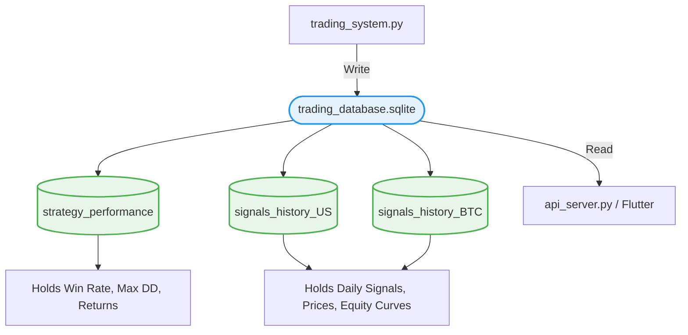

# เจาะลึกการทำงาน: `workflows/trading_database.sqlite`
**(คลังสมองความจำถาวร - The Persistent Memory Bank)**

ระบบเทรด AI ของเรา แม้จะคำนวณกราฟปัจจุบันและวิเคราะห์อนาคตได้อย่างแม่นยำ แต่มันจะ "ลืม" ทุกอย่างทันทีเมื่อเราปิดโปรแกรม หากไม่มีระบบความจำถาวรมาระบบ 

ไฟล์ `trading_database.sqlite` จึงถูกสร้างขึ้นมาเพื่อรับบทเป็น **"สมุดจดบันทึกประจำวันและพอร์ตการลงทุน"** ของ AI แบบออฟไลน์ (ไม่ต้องง้อฝากข้อมูลไว้ที่เซิฟเวอร์อื่น) ซึ่งมีขนาดเล็ก เบา และทรงประสิทธิภาพ

เมื่อเราเจาะเข้าไปดูโครงสร้างตาราง (Schema) ภายในไฟล์นี้ จะพบว่ามันแบ่งสมุดจดออกเป็น 2 ประเภทหลักๆ ดังนี้ครับ:

## 1. ตารางเกียรติยศ (Table: `strategy_performance`)
ตารางนี้เปรียบเสมือน **"ใบประกาศนียบัตร"** ที่บอกว่า AI ของเราเก่งแค่ไหนในแต่ละสมรภูมิ
- **หน้าที่:** เก็บสถิติความสำเร็จในภาพรวม (Summary Metrics) แบบสรุปรวบยอดของทุกตลาด
- **คอลัมน์สำคัญที่ถูกบันทึกไว้ในตาราง:**
  - `market`: ชื่อสมรภูมิ (เช่น US, BTC, Gold)
  - `base_return_pct`: กำไรสุทธิจากระบบ AI (%)
  - `bnh_return_pct`: กำไรสุทธิถ้าซื้อทิ้งไว้โง่ๆ (%) เพื่อเอามาเทียบกันว่า AI เก่งกว่าจริงป่าว
  - `win_rate_pct`: อัตราการยิงออเดอร์แล้วเข้าเป้า (%)
  - `max_drawdown_pct`: ค่าความปวดร้าวสูงสุด พอร์ตเคยติดลบลงไปกี่เปอร์เซ็นต์
  - `total_trades`: จำนวนครั้งที่ขยับตัวเข้า-ออก
- **ใครเป็นคนใช้:** ฝั่ง Backend (เช่น `api_server.py`) จะวิ่งมาอ่านตารางนี้เพื่อส่งค่าตอบให้หน้าจอแดชบอร์คแสดงสถิติสรุปความเก่งของทบอทเหนือหน้าเว็บ หรือส่งให้ `LLM MoE` เอาสถิติพวกนี้ไปโม้เป็นภาษาคน

## 2. ตารางบันทึกสัญญาณรายวัน (Tables: `signals_history_...`)
ระบบจะสร้างตารางประวัติศาสตร์แยกกันของแต่ละตลาดอย่างชัดเจน เช่น `signals_history_US`, `signals_history_BTC`, `signals_history_Thai` ฯลฯ
- **หน้าที่:** เป็น "สมุดจดบันทึกการเทรดรายวัน" ว่าเมื่อวาน AI คิดอะไร วันนี้ AI คิดอะไร เพื่อวาดกราฟสะสม
- **คอลัมน์สำคัญที่ถูกบันทึกไว้ในตาราง (จะถูกเพิ่มวันละ 1 บรรทัด):**
  - `date` & `price`: วันที่และราคาปิดของสินทรัพย์ในวินาทีนั้น
  - `trend_regime`: เรดาร์มองว่าวันนั้นเป็นขาขึ้น (1) หรือขาลง (0)
  - `ml_up_prob` & `ml_down_prob`: AI ให้เปอร์เซ็นต์ความน่าจะเป็นที่จะขึ้นและลงไว้ที่เท่าไหร่
  - `signal_action`: สุดท้ายแล้ว AI สั่งยิงคำสั่งอะไรลงไป (BUY 🟢, SELL 🔴, HOLD ⚪)
  - `position`: สถานะพอร์ต ณ ตอนนั้น (ถือของเต็มแมกซ์ 1.0 หรือกำเงินสด 0.0)
  - `equity_curve` & `bnh_curve`: มูลค่าเงินในพอร์ต AI เทียบกับพอร์ต Buy & Hold ในวันนั้น เพื่อเสกเส้นกราฟสวยๆ 2 เส้นตีคู่กันไปเรื่อยๆ

## ระบบนิเวศ (Ecosystem)
ไฟล์นี้คือ **"หัวใจศูนย์กลาง"** ที่เชื่อม 3 โลกเข้าด้วยกัน:
1. ไฟล์ **AI Trading System** มีหน้าที่ **Write (เขียน/บันทึก)** ค่าลงมาเก็บทุกเช้า
2. ไฟล์ **API Server** มีหน้าที่ **Read (อ่าน)** ข้อมูลขึ้นไปประมวลผลให้ LLM อ่าน หรือส่งต่อให้ช่องทางอื่น
3. ฝั่ง **Flutter / Website Frontend** มีหน้าที่ดึงข้อมูลไป **Render (แสดงผล)** เป็นเส้นกราฟล้ำยุคให้เราดู
