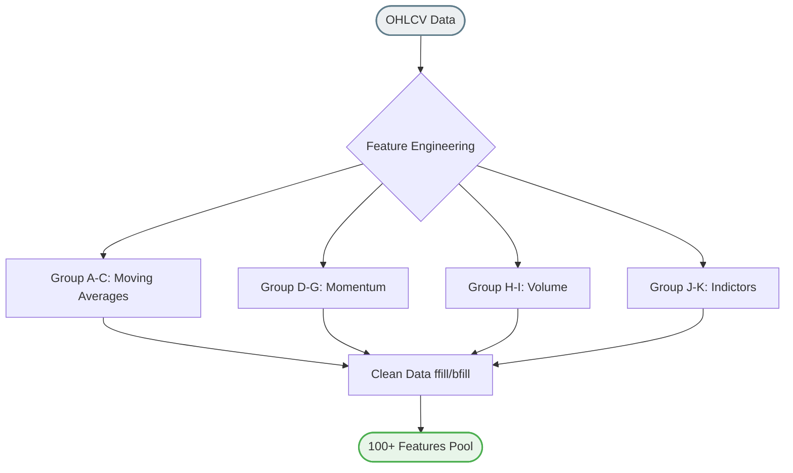

# เจาะลึกการทำงาน: `model/features.py` 
**(โรงงานสกัดตัวแปรอินดิเคเตอร์เชิงลึก - Feature Engineering)**

ไฟลนี้เปรียบเสมือน **"ต้นน้ำ"** ของระบบ AI ทั้งหมด เพราะ AI ไม่สามารถอ่านกราฟแท่งเทียนด้วยตาเปล่าได้เหมือนมนุษย์ หน้าที่ของไฟล์นี้คือการแปลง "ราคา (Price)" และ "ปริมาณ (Volume)" ให้เป็น "ตัวเลขทางสถิติ (Features / Indicators)" กว่า 100+ ตัวแปร เพื่อให้ AI มองเห็นแพทเทิร์นและการแกว่งตัวของตลาด

## 1. ข้อมูลขาเข้า (Inputs)
- ไฟล์นี้คาดหวังตารางข้อมูลตระกูล Time-Series ที่มีคอลัมน์มาตรฐาน ได้แก่ `Open`, `High`, `Low`, `Close`, `Volume` แบบรายวัน 

## 2. กลุ่มตัวแปรที่ถูกสร้างขึ้น (Feature Groups)
ระบบจะทำการคำนวณสูตรทวีคูณออกมาเป็นตัวแปรถึง "11 กลุ่มหลัก (Group A-K)" ซึ่งคลุมทุกมิติของการวิเคราะห์ทางเทคนิค:

**กลุ่มพื้นฐาน (Moving Averages & Crossovers):**
- **Group A (MA Uptrend Binary):** ถามว่าตอนนี้เส้นค่าเฉลี่ย 5, 10, 20, 60, 120 วัน กำลังชี้ขึ้นหรือชี้ลง? (สกัดออกมาเป็นค่า 0 กับ 1) ช่วยให้ AI เข้าใจความชันของเทรนด์
- **Group B (MA Comparisons):** ถามว่าเส้นสั้นอยู่เหนือเส้นยาวหรือไม่? (เช่น MA5 > MA20) เป็นการจำลองกลยุทธ์ Golden Cross / Death Cross ให้ AI เข้าใจ
- **Group C (Price vs MA):** ถามว่าแท่งเทียนปัจจุบันยืนอยู่เหนือเส้นค่าเฉลี่ยหรือไม่?

**กลุ่มวัดแรงเหวี่ยงและระยะทาง (Dispersion & Momentum):**
- **Group D & G (Price Disparity & MA Distance):** วัดระยะห่างเป็น % ว่าตอนนี้ราคาวิ่งหนีห่างจากเส้นค่าเฉลี่ยมากแค่ไหน (ตึงเกินไป หรือมีโอกาส Remean/ย่อตัวกลับ)
- **Group E (Price MA Gradient):** วัดอัตราเร่งความชันของเส้นค่าเฉลี่ยแต่ละตัว (หา Momentum การระเบิดของราคา)
- **Group F (Rate of Change - ROC):** คำนวณ%การเปลี่ยนแปลงของราคาเทียบกับอดีตย้อนหลังในรอบ 1, 2, 4, ... จนถึง 68 วัน เพื่อดูพัฒนาการของทิศทาง

**กลุ่มวิเคราะห์ปริมาณการซื้อขาย (Volume Analysis):**
- **Group H & I:** เหมือนกลุ่ม Distance ร่างบน แต่นำเส้นค่าเฉลี่ยของ "ปริมาณซื้อขาย (Volume MA)" มาหาค่าความผิดปกติ (Anomaly) การลากราคาพร้อมวอลุ่มแปลกๆ

**กลุ่มอินดิเคเตอร์สากลที่ถูกปรับปรุงให้ AI กินง่าย (Optimized Technical Indicators):**
- **Group J:** แกนกลางที่นักเทรดคุ้นเคย แต่ถูกปรับสมการให้ผลลัพธ์อยู่ในกรอบที่ AI เข้าใจง่าย (Normalized)
  - **RSI:** หา Overbought / Oversold
  - **MACD:** หาการบรรจบและแยกตัวของเทรนด์
  - **Bollinger Bands:** ดูความกว้างของกรอบความผันผวนย้อนหลัง 20 วัน (BB Width) และดูว่าราคาชนขอบเหว หรือชนเพดาน (BB Pos)
  - **ATR (Average True Range):** ดัชนีวัดอารมณ์ความรุนแรงของแท่งเทียน (Volatility)
  - ร่วมด้วย Stochastic, Momentum, Williams %R 

**กลุ่มห้องสมุดเทคนิคเสริม (TA Library Integration):**
- **Group K:** ระบบทำการเชื่อมต่อกับไลบรารียอดฮิต `ta` ของ Python เพื่อกวาดตัวแปรทุกรุปแบบในสากลโลกใส่รวมเข้ามาเป็น Features พิเศษเพิ่มเติม 

## 3. การจัดการข้อมูลสูญหาย (Data Cleaning)
ปัญหาของการสร้างอินดิเคเตอร์ย้อนหลัง เช่น MA120 คือ 119 วันแรกจะไม่มีค่า (เป็นค่าว่าง หรือ NaN)
- ไฟล์นี้จัดการ NaN ด้วยวิธี **Forward Fill (ffill)** และ **Backward Fill (bfill)** อย่างระมัดระวัง เพื่อป้องกันไม่ให้เราต้องดรอปคอลัมน์หรือเสียแถวข้อมูลของตลาดเกิดใหม่ที่มีประวัติกาลักสั้นๆ ไป

## 4. ตะแกรงร่อนตัวแปรสุดยอด (Feature Selection Alias)
- ท้ายไฟล์จะมีระบบ `get_feature_columns()` เพื่อไปอ่านไฟล์ `selected_features.json` ว่า "ในการเทรนโมเดลรอบนี้ ต้องหยิบแค่กี่สิบฟีเจอร์ที่สำคัญสุดมาใช้" (ถ้ากราฟดิบมี 150 ตัวแปร มันจะคัดเหลือแค่ Top 15-20 ตัวที่เทพที่สุด ส่งต่อไปให้โมเดล)
- โดยมี `default_selected` (Top 88 ตัวแปรระดับโลก) เป็นแผนสำรอง หากระบบยังไม่เคยผ่านการเฟ้นหาอัตโนมัติมาก่อน
