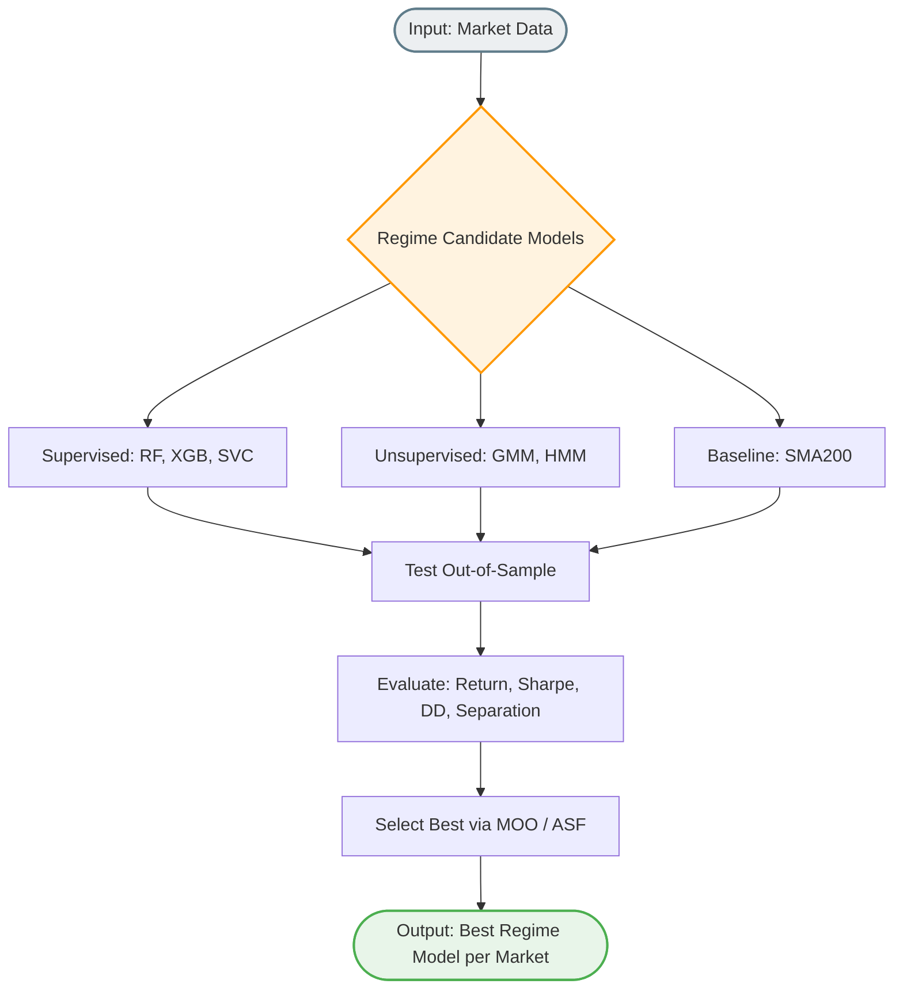

# เจาะลึกการทำงาน: `all_trad/train_regime_models.py`
**(ศาลสูงสุดกำหนดสภาวะอากาศตลาด - The Regime Selector Engine)**

คุณไม่ควรกางสายร่มหลบฝน ในวันที่พายุเฮอร์ริเคนเข้า... เช่นเดียวกัน การใช้ AI ที่เทรนมาเพื่อเก็งกำไรช่วงเทรนด์ตลาดพุ่งเอาๆ (Uptrend) ไปรันช่วงที่เงินเฟ้อพังพินาศและคริปโตยับเยิน (Downtrend) ถือเป็นการฆ่าตัวตาย ไฟล์ตระกูล Regime จึงถูกแยกตัวออกมาเพื่อเป็น **"ผู้สังเกตการณ์ภาพใหญ่"** 

หน้าที่เดียวของไฟล์นี้ ไม่ใช่การบอกว่าจุดไหนคือจุดตีฝ่า (Breakout) เพื่อเข้าซื้อ... แต่เป็นการแปะป้ายกำกับว่าในทุกๆ แท่งเทียนรายวัน วันนั้นๆ ถือเป็น **ฤดูขาขึ้นหนุึ่ง (1) หรือ ขาลงศูนย์ (0)** ให้กับสินทรัพย์แต่ละชนิดแยกทีละตัวๆ 

## 1. ขบวนการเสกเครื่องมือกะเทรนด์ (The Suite of Regime Models)
ระบบได้ยกกระบวนรบ AI ถึง 6 ศาสตร์และ 2 อินดิเคเตอร์มาคำนวณแยกเพื่อมองภาพเทรนด์ ได้แก่:
- **(A) ตระกูลเรียนรู้ตามผลลัพธ์อนาคต (Supervised Learning):** 
  จับ `RF, XGBoost, SVC, LogisticRegression` มาสอนเดาอนาคตว่า "ถ้าซื้อวันนี้ แล้วอีก 20 วันข้างหน้าราคาจะโผล่หัวเป็นบວກหรือไม่?" ถ้าบวก แปลว่านับตั้งแต่วันนี้ถึงวันนั้น ถือเป็นสวิงขาขึ้น (Uptrend) นำตัวแปรคัดพิเศษจากระบบมากางให้เรียนรู้
- **(B) ตระกูลแยกค่ายสถิติแบบหาจุดเกาะกลุ่ม (Unsupervised Clustering):**
  ไม่ได้สนกำไรขาดทุน แต่เอาราคาผันผวน (Volatility) โยนกลับไปให้สมการสถิติขั้นสูงอย่าง `GMM` (Gaussian Mixture) กับ `HMM` (Hidden Markov Model) แบ่งโซนว่า "พฤติกรรมทรงนี้ น่าจะเป็นตลาดหมี (ความผันผวนพุ่งติดลบกระชากกระชั้น) แล้วพฤติกรรมทรงขึ้นลิฟท์เงียบๆ นี้คือตลาดกระทิง"
- **(C) ตระกูลเกาะติดค่าเฉลี่ยแบบฝรั่ง (Baseline Indicator):**
  ใช้ค่า Moving Average 200 วัน (SMA200) และกระบวนท่ายอดฮิตอย่าง ADX Supertrend เป็นม้าหน้าเปิดมาเทียบความเก่ง

## 2. ลานประลองวัดขีดจำกัด (The Evaluation Arena)
แค่ทายว่าพรุ่งนี้ฝนตกแม่นไหม ถือว่าไม่พอสำหรับหุ่นยนต์เทรดจริง สคริปต์นี้ตั้งเวทีขึ้นมาระหว่าง AI ทุกตัวบนส่วน **ข้อมูลที่ไม่เคยเห็นมาก่อน (Out-of-Sample / 20% หลังสุดของไทม์ไลน์ตลาด)**
แล้วตรวจสอบว่า "ถ้าให้คะแนนการเทรดตามฤดูที่คุณตอบมา คุณทำได้ดีแค่ไหน?"
1. **Return:** กำไรล้วนๆ ได้เท่าไหร่?
2. **Sharpe Ratio:** กำไรที่ได้ คุ้มเสี่ยงหรือไม่ หรือได้กำไรมาด้วยความเสียวไส้ระดับพังพอร์ต?
3. **Max Drawdown (MaxDD):** เกิดการทรุดฮวบของการเติบโตของเงินมากแค่ไหน?
4. **Separation:** ความชัดเจน คือถ้าคุณบอกเป็นบวก กราฟต้องทะยานฟ้า ถ้าคุณชี้ว่าลง กราฟต้องร่วงหนัก "ห้ามแทงกั๊ก หรือบอกขึ้นแต่ราคาดันนิ่ง"

## 3. ผู้ตัดสินนรก (Multi-Objective Optimization / M.O.O)
ปัญหาคลาสสิคคือ "ไม่มีระบบไหนเพอร์เฟค" (สมมุติ HMM กำไร 100% แต่พอร์ตยุบ 80% ระหว่างทาง... เทียบกับ Logistic Regression กำไร 40% แต่พอร์ตยุบไม่เกิน 5%) วิธีไหนควรเป็นตัวนำ?
- ระบบหยิบหลักการของ **Pareto Front** มาตัดช้อยที่โง่ทิ้งทั้งหมด (ช้อยที่ห่วยกว่าคนอื่นในทุกมิติ)
- จากนั้นใช้อาวุธไม้ตายชี้ขาดแบบเครื่องชั่งน้ำหนักที่เรียกว่า **ASF (Achievement Scalarizing Function)** 
- ASF จะถ่วงน้ำหนักว่าให้ Return = 40%, แยกโซนแม่น=20%, ชาร์ปเรโช=20%, อัตราลบน้อยสุด=20% 
- **และกดเลือกสุดยอด Regime Detector ให้โดยอัตโนมัติ**

## 4. บทสรุปและรอยชิ้นส่วน (Artifacts Saved)
เมื่อตัดสินจบ เช่น สมมุติตลาด SET ไทย ได้ XGBoost เป็นฮีโร่ / ตลาด Crypto-BTC ได้ GMM คุมบังเหียน 
ไฟล์นี้จะทำการ:
1. `joblib.dump` เก็บสมองของโมเดลผู้ชนะเลิศไปในโฟลเดอร์ `regime_models` แยกตามชื่อประเทศให้ 
2. เซฟกุญแจความจำว่า ใครคือที่ 1 ไว้อ่านตอนรันบอทจริงใน `best_regime_meta_ตลาด.pkl`
3. พ่นสรุปออก Excel `regime_evaluation_summary.csv` ให้บอทและคนเอาไปอ่านสถิติประดับความรู้เพื่อวิเคราะห์ต่อ
