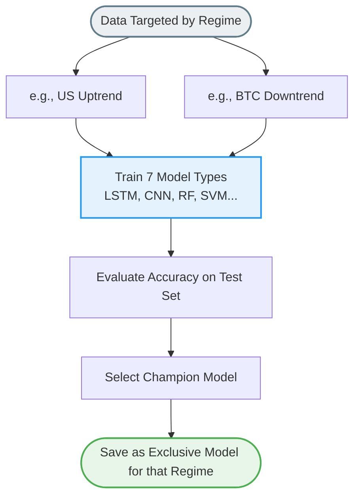

# เจาะลึกการทำงาน: `model/train_separate_models.py`
**(สำนักฝึกเพชฌฆาตหน้าตาย - The Specialized Mixture of Experts)**

เมื่อคุณรู้ล่วงหน้าแล้วว่าสภาพตลาดของปีก่อนกับปีนี้มันต่างกันฟ้ากับเหว (Uptrend ปะทะ Downtrend จาก `train_regime_models.py`) ก็ไม่มีเหตุผลอะไรที่คุณจะต้องใช้ AI สมองเดียวในการเอาขี่ม้าดวลกับทุกๆ ขวากหนาม

ไฟล์ `train_separate_models.py` นี่แหละครับคือการ **"ฉีกกฎ"** ด้วยการสร้างกองพันนักรบที่เรียกว่า Mixture of Experts (สมาคมผู้เชี่ยวชาญ) หน้าที่ของมันคือดึงทรัพยากรทุกอย่างและพิมพ์เขียวทุกอย่างจากโฟลเดอร์รหัสมาสวมเข้าร่าง "ทหารเกณฑ์" เพื่อเฟ้นหาแม่ทัพนายกองที่เก่งที่สุด "แบบเจาะงบประมาณซอยย่อย" ลงไปทีละเทรนด์และทีละตลาด

## 1. กลยุทธ์แยกส่วนฐานข้อมูล (Data Targeting)
แทนที่จะโหลดกราฟยาวๆ ม้วนเดียวจบสิบปี ไฟล์นี้ถูกตั้งโปรแกรมให้ไปซักถามตารางกราฟย่อยๆ ที่ถูกแบ่งหั่นเอาไว้แล้ว ผ่านฟังก์ชัน `load_market_trend_data`
- ตลาดหุ้นสหรัฐช่วงขาขึ้น (`US_uptrend_labeled`)
- ตลาดหุ้นสหรัฐช่วงขาลง (`US_downtrend_labeled`)
- ตลาดบิทคอยน์ช่วงขาขึ้น (`BTC_uptrend_labeled`)
... แยกเป็นคู่ๆ ไว้ให้หมด

มันจะดึงตัวแปรที่คัดพิเศษจากการกรองมาแล้ว (Feature Selection) และปั้นก้อนแพทเทิร์นย้อนหลัง 30-60 วัน (Lookback Arrays) ให้กลายเป็นม้วนเทป 3 มิติ เพื่อเตรียมป้อนเข้าสู่สายพานการผลิต AI ของ Keras (Tensorflow) หรือ Sklearn (สำหรับโมเดลรุ่นเก๋า)

## 2. ทุบขีดจำกัดด้วยโมเดลถึง 7 ชนิดต่อ 1 ภูมิประเทศ
ในลูปใหญ่ของการประมวลผล แต่ละซับ-โฟลเดอร์พื้นที่ (เช่น ขาขึ้นของทองคำ) จะทำการเบิกโครงสร้างโมเดลตัวแกร่งมารันแข่งกันเรียงหน้ากระดาน 7 รูปแบบอย่างหนักหน่วง:
- ฝั่ง Deep Learning จาก `models.py` (ดึงแปลน LSTM, CNN, MLP, Transformer มาประกอบ)
- ฝั่ง Machine Learning ฮาร์คอร์ (RandomForest, Support Vector Machine, XGBoost)

การออกแบบนี้คือความงามของอิสระภาพ เพราะตลาดหุ้นช่วงขาขึ้น ส่วนใหญ่อาจจะต้องการตัวขับเคลื่อนที่จับแรงส่งได้เนียนอย่าง LSTM หรือ Transformer... แต่พอช่วงตลาดพังพินาศขาลง ที่ความผันผวนดีดมั่ว กราฟสับหลอกไม่เป็นทรง Deep Learning อาจสับสน แต่ SVM แผนภูมิคณิตศาสตร์โบราณอาจะตัดคัตลอสจับจังหวะซื้อสวนแม่นกว่า! ดังนั้นให้มันเทรนแข่งกันสดๆ แล้วเลือกผู้ชนะไปเลยตัวต่อตัว

## 3. กรอบประเมินสายดาร์ค (Strict Model Evaluation)
- ข้อมูลจะถูก Standardization (กดความผันผวนให้มาอยู่ในสมการ 0-1) ให้ AI วิ่งหาทางออกได้ง่ายขึ้น
- เลเบลเป้าหมาย 2 แกน (Binary) คือขึ้นแรง (1) หรือลงแรง (0) หากเข้าจุดเสี่ยงสูงจะมีกลไก Label Smoothing (เช่น 0.1) ทำให้โมเดล AI ลังเลไม่กล้ายืนกราน 100% ว่าจะเกิดหน้าไหน เพื่อลดความมั่นใจจนเกินไป (Overconfidence bias ซึ่งเป็นศัตรูร้ายในวงการตลท.) 
- พอกลั่นออกมาได้ จะประเมินด้วยความแม่นยำรวมบนสนามทดสอบที่ไม่ถูกนำมาสอน (Test Set Accuracy) ตัวไหนสามารถส่งสัญญาณเดาใจกราฟได้เปอร์เซ็นต์ถูกต้องสุด จะครองตำแหน่งหัวหน้าในพื้นที่นั้น 

## 4. ผลสำเร็จขั้นสุดท้าย (Persisting Specializations)
เมื่อได้แชมป์เปี้ยนผู้ชนะ ไฟล์จะทำการเซฟอ็อกเจ็กต์น้ำหนักความรู้ที่ถูกบันทึกลง:
- โฟลเดอร์ที่แสนจะเฉพาะเจาะจง เช่น สร้างโฟลเดอร์ชื่อ `model_BTC_downtrend` แล้วซุกอาวุธระดับพระกาฬอย่าง `CNN.keras` ที่ถูกเลือกแล้วเอาไว้ข้างใน
- ทุกสภาวะภูมิประเทศที่เทรนเสร็จ จะถูกเขียนสรุปส่งไปยังตารางแผงบัญชาการ `separate_models_comparison.csv` ให้ตัวแม่สามารถมาส่องดูได้ว่า วันนี้ตลาดชี้ว่า BTC อยู่ในหมีขาลง... ตัวแม่ต้องวิ่งไปยืมพลัง CNN แถวๆ กล่องดาร์กโฟลเดอร์นี้มาประกอบร่างแทน

ระบบนี้ทำให้คุณ **"เหมือนมีคนเทรดร้อยสไตล์รุมวิเคราะห์พอร์ตคุณ และเลือกใช้คนให้เหมาะสมกับเวลาโดยอัตโนมัติ 100%"**
