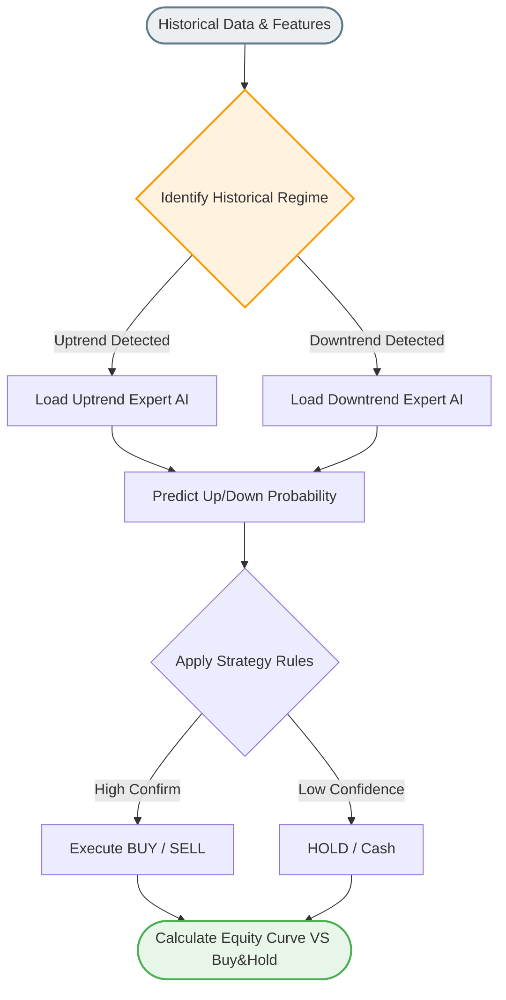

# เจาะลึกการทำงาน: `model/backtest_all_models.py`
**(สมรภูมิประเมินผลเครื่องขุมพลัง AI ทุกตัว - The Ultimate Backtest Arena)**

ไฟล์นี้ทำหน้าที่เป็นเหมือน **ผู้ตรวจการบัญชีการเก็งกำไร** มันไม่ได้ทำหน้าที่จำลองเทรดจริงในหน้าเว็บ (เหมือน Trading System) แต่มันถูกออกแบบมาเพื่อ "พิสูจน์ทราบว่า AI กองกำลัง Mixture of Experts ของเรา เอาชนะตลาดได้จริงหรือไม่ ในสเกลของไฟล์บิลด์"

## 1. จุดประสงค์ของสนามประลอง
หลังจากที่เราเทรน AI เป็นร้อยๆ ตัว แยกตามตลาด (BTC, US, Gold) และตามเทรนด์ (Uptrend, Downtrend) ผ่านไฟล์ `train_separate_models.py` แล้ว... เราต้องมีตัวเลขสักชุดที่ยืนยันว่า:
*"ถ้าเมื่อ 10 ปีก่อน เราเอา AI ชุดนี้ทั้งหมด ไปวางเงินล้านทิ้งไว้จริงๆ เทียบกับการเอาเงินล้านไปซื้อทิ้งไว้เฉยๆ (Buy & Hold) ใครจะวิน?"*

## 2. กลไกการขับเคลื่อนลูปแห่งอดีต
1. **รวบรวมขุนพล:** ไฟล์นี้จะกางไฟล์ `separate_models_comparison.csv` (รายชื่อสอบผ่านของ AI ทุกสำนัก) เพื่อดึงแชมป์เปี้ยนหมายเลข 1 ประจำ Uptrend และ Downtrend ของแต่ละตลาดออกมายืนตั้งแถวรอ
2. **มองเห็นอดีต:** รันซ้ำกระบวนการเดิมคือคำนวณกราฟ (`features.py`) 
3. **ตรวจสอบสภาพภูมิอากาศ:** มีฟังก์ชันวิเคราะห์ (อาจจะดึงผ่าน MA หรือ HMM) ว่า "วันที่ 5 มกราคม ปี 2018 ถือว่าเป็นขาขึ้นหรือขาลง"
4. **การสับเปลี่ยนตัวตายตัวแทน (Dynamic Expert Switching):**
   - ถ้าระบบเจอว่ากราฟตอนนั้นล่มสลายเป็น "ขาลง": มันจะเบิกไฟล์ย้อนหลังความจำไปให้ **"AI ผู้เชี่ยวชาญขาลง (เช่น SVM)"** ทำนายสัญญาณ
   - แต่ถ้าอีกสามเดือนต่อมา กราฟพุ่งระเบิดเปลี่ยนเป็น "ขาขึ้น": มันจะเตะ AI ตัวเก่าออกทันที แล้วโยกงานให้ **"AI ผู้เชี่ยวชาญขาขึ้น (เช่น LSTM)"** ทำงานหาจุดเข้าซื้อแทน!
   - (นี่คือความสวยงามของสถาปัตยกรรมสลับโหมดอัตโนมัติ)

## 3. กฎของสมรภูมิ (Backtest Rules)
เมื่อได้ความน่าจะเป็น (Probability) จาก AI มาแล้ว มันจะเข้าสู่วงจรการตั้งกราฟจริง:
- จะสั่ง **Buy (1)** ถ้า AI มั่นใจว่ากราฟเขียวแน่นอน
- จะสั่ง **Short (-1)** ถ้าระบบยอมให้แทงขาลงได้ (หากเปิดสวิตช์อนุญาต)
- จะสั่ง **Hold (0 / หลบเข้าเงินสด)** หาก AI เริ่มลังเลว่าไม่ชัวร์ ถือเป็นการหลบภัยคลื่นกระแทก

## 4. ผลประกอบการของชีวิต (Performance Reports)
เมื่อวิ่งผ่านกาลเวลาหลายสิบปี ไฟล์นี้จะคำนวณหาสถิติที่เจาะลึกสุดๆ ออกมาเพื่อตีแผ่:
- **Total Strategy Return:** AI ปั้นพอร์ตเติบโตไปกี่ %
- **Buy and Hold Return:** ถ้าคนทั่วไปซื้อโง่ๆ ถือยาว กำไรเท่าไหร่
- **Win/Loss Ratio:** ความแม่นยำในการกระดิกนิ้วเทรดแต่ละครั้ง
- **Maximum Drawdown (ความปวดร้าว):** ระหว่างทาง พอร์ตเราหลุมลึกสุดกี่เปอร์เซ็นต์ (สิ่งนี้นักลุงทุนแคร์มากกว่ากำไรสูง)

ท้ายสุด ไฟล์นี้จะวาดรูปสวยๆ เป็น Equity Curve หลงเหลือทิ้งไว้ เผยฉายาให้เห็นว่าจุดไหน AI สั่งหลบจุดตกต่ำของตลาดหุ้นได้ ทำให้เส้นสีเขียว (พอร์ต AI) เอาชนะเส้นสีส้ม (พอร์ตทิ้งขว้าง) ได้ชี้ชัดเลยครับ
