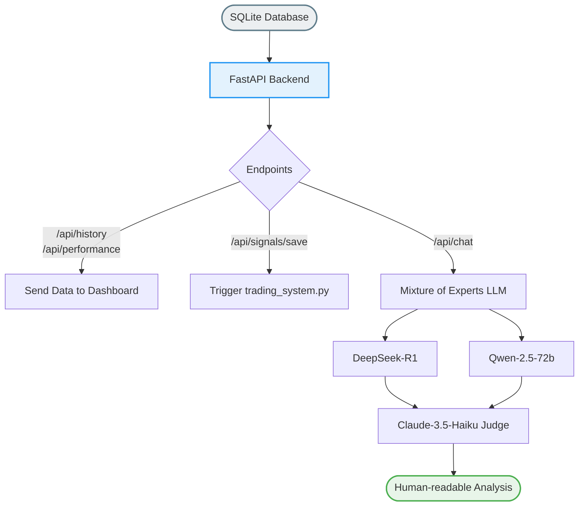

# เจาะลึกการทำงาน: `workflows/api_server.py`
**(ศูนย์บัญชาการส่งผ่านข้อมูลและปัญญาประดิษฐ์ข้อความ - The API Backend & MoE LLM)**

ในขณะที่ไฟล์อื่นๆ ในโฟลเดอร์รหัสทำงานอยู่หลังบ้าน คอยปั่นตัวเลขคณิตศาสตร์เงียบๆ `api_server.py` คือ **"พนักงานต้อนรับและนักวิเคราะห์ข่าว"** เพื่อเชื่อมต่อระบบสุดโหดเหล่านั้น เข้าสู่สายตาของมนุษย์ (หน้าแดชบอร์ด HTML หรือแอป Flutter)

ไฟล์นี้ทำงานด้วยเฟรมเวิร์ก **FastAPI** ซึ่งรองรับข้อมูลได้รวดเร็วและพร้อมกันเป็นจำนวนมากๆ 

## 1. จุดเชื่อมข้อมูลหลัก (Database Endpoints)
- หน้าที่พื้นฐานของไฟล์นี้คือการต่อท่อกับฐานข้อมูลออฟไลน์ `trading_database.sqlite` (ที่ระบบเทรดได้โยนสถิติการขยับของกราฟรายวันมาเซฟทิ้งไว้)
- มันเปิดช่องทาง (Endpoint) เช่น `/api/performance` และ `/api/history` เพื่อให้แดชบอร์ดหน้าบ้าน เข้ามา "ขอดึงประวัติการเทรด" เอาไปใช้วาดกราฟ และวาดตารางสถิติสรุปว่า ตอนนี้ Win Rate กี่เปอร์เซ็นต์ กำไรเทียบพอร์ตโง่ๆ ต่างกันแค่ไหน

## 2. หัวใจเด็ด: Mixture-of-Experts (MoE) LLM Analysis
นี่คือฟีเจอร์ระดับ Next-gen ของ API ตัวนี้! การมีแต่เส้นกราฟและตัวเลขบางครั้งมนุษย์เราก็ตีความไม่ออก:
- ไฟล์นี้จัดเตรียมเส้นทาง `/api/chat` ที่ตั้งค่าให้เรียกใช้ **โมเดลภาษาขนาดใหญ่ (Large Language Model - LLMs)** 
- **มันไม่ได้ถาม AI แค่ตัวเดียว แต่ใช้วิชาดวลความเห็น (Mixture of Experts)!**
  - **Expert 1 (นกฮูกนักประวัติศาสตร์):** ดึง `DeepSeek-r1` มาเป็นคนแรก ให้เก่งเรื่องเจาะลึกสมการและเหตุผลเชิงลึก
  - **Expert 2 (นักกลยุทธ์ตามกระแส):** ดึง `Qwen-2.5-72b-instruct` มาอีกคน เพื่ออ่านทิศทางข่าวรวมๆ กว้างๆ
  - **Master Judge (หัวหน้าผู้ตัดสิน):** ดึงยอดอัจฉริยะอย่าง `Claude-3.5-Haiku` มาเป็นคนสรุปขั้นสุดท้าย มันจะนั่งอ่าน "ตัวเลขกราฟดิบจากฐานข้อมูล" บวกกับ "ความเห็นของสองลูกน้อง" แล้วเขียนร้อยแก้วสรุปสถานการณ์ให้ผู้ใช้งานอ่านแบบฉะฉาน เป็นภาษาไทยที่สวยงาม!

## 3. ตัวเซฟข้อมูลประจำวัน (Daily Cronjob Trigger)
- มันมีปุ่มกด (Endpoint) `/api/signals/save` เมื่อถูกเรียก มันจะรันคำสั่งบังคับให้ไฟล์ตัวแม่ทำเงินอย่าง `trading_system.py --json` ทำงาน
- พอระบบเทรดทำงานเสร็จพ่นค่าออกมา มันก็จะจับค่านั้น หยอดกระปุกลงตาราง SQLite `signals_history_{market}` ของวันนั้นๆ อัตโนมัติ เพื่อสะสมเป็นสถิติใหม่ 

**สรุป:** ไฟล์นี้คือ "ล่ามแปลภาษา" ที่เปลี่ยนตัวเลขยากๆ เป็นพอร์ตข้อมูลให้โปรแกรมอื่นอ่านง่ายขึ้น และเป็น "ผู้ประกาศข่าวเศรษฐกิจ AI" ที่คอยพากย์สิ่งที่บอทเทรดกำลังกระทำอยู่ให้เราเข้าใจนั่นเอง!
